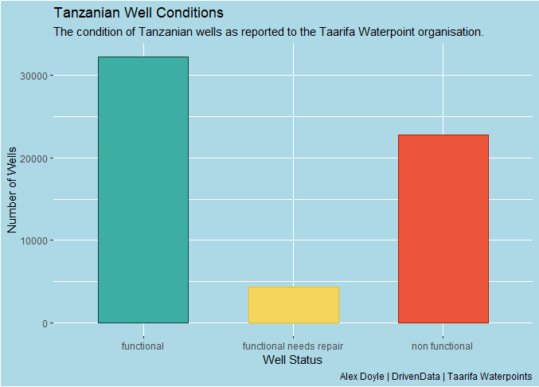

# Big Data

## The Problem

Pump it up: Data Mining the Water Table 

from DrivenData currently over 10,000 entries

https://www.drivendata.org/competitions/7/pump-it-up-data-mining-the-water-table/page/23/

Competition runs until **2021-11-01** if anyone is interested

## Taarifa 

Taarifa is an open source platform for crowd sourced reporting and sorting of infrastructure issues (e.g., the public toilet is broken). 

Based on the [**Taarifa API**,](https://github.com/taarifa/TaarifaAPI) founded in 2011 and has been deployed in Uganda, Ghana and Tanzania. 

[**Taarifa Waterpoints**](https://github.com/taarifa/TaarifaWaterpoints) is the main distribution of the core API. With Waterpoints focusing recording and tracking wells around these countries but mainly focusing on Tanzania. 
Source: https://github.com/taarifa/TaarifaWaterpoints

## The Challenege

The Pump it Up Challenge consists of data from Taarifa and the Tanzanian Ministry of Water. (Hoseted by [**DataDriven**](https://www.drivendata.org/competitions/7/pump-it-up-data-mining-the-water-table/page/23/))

The task consists of predicting which pumps are

- `functional`

- `functional needs repair`

- `non functional`

based on a number of variables recorded about the waterpoints.

The aim is to gain a smart understanding of which waterpoints will fail and improve maintenance operations to ensure clean potable water to communities across Tanzania. 

## The Data
* `Training set values` - 59,401 rows, recording individual waterpoints across 39 variables

* `Training set labels` - 59,401 rows containing 2 variables `id` and `status_group`

* `Test set values` - 14,851 rows recording individual waterpoints across 39 variables

## Big Data 

While this data would not be considered "Big Data" the technology for data input is scalable and therefore could quickly become too much for a single machine to handle. 

This is an important consideration when designing the prediction model. 

To take this into account a local spark connection will be used to simulate using cluster computing which could be applied if the waterpoint recording became more mainstream. 

## The Plan

I aim to use machine learning techniques to develop a classifier to predict the state of the wells in Tanzania.

Random 

Using `spraklyr` and the `random_forest_classifier` function to develop a prediction model using random forest.  

Accuracy will be assessed by entering it into the competition where the test data predictions will be compared with the withheld labels. 

The top score so far is a classification rate of 82.94%.

## Thank You

The data is available from my github if anyone wants to explore it or have a go

https://github.com/alexdoyle115/C7084_Big_Data

All data sourced from [DrivenData](https://www.drivendata.org/competitions/7/pump-it-up-data-mining-the-water-table/)

.](/Users/alexd/Desktop/C7084-Assignment/img.jpg){width=50%}

